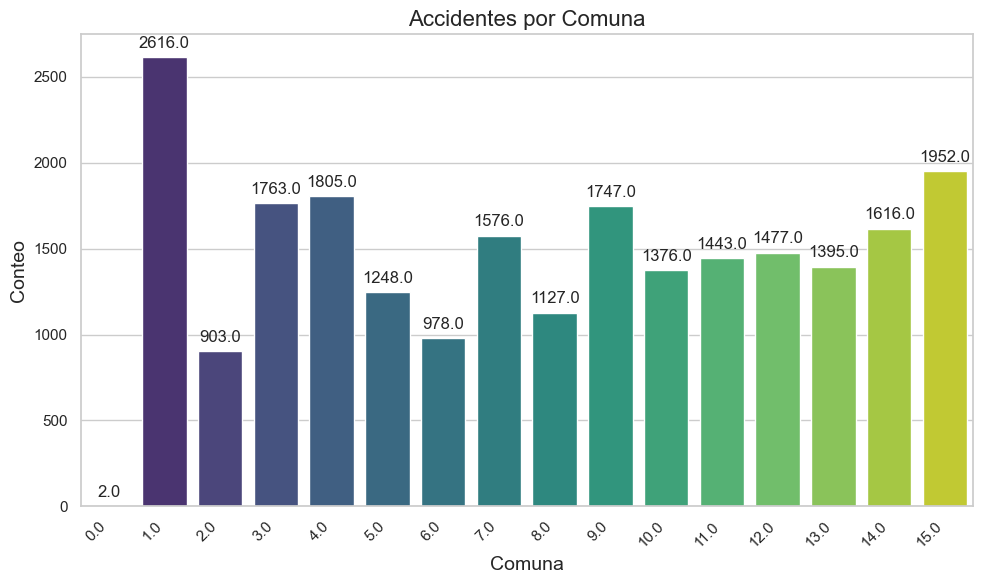
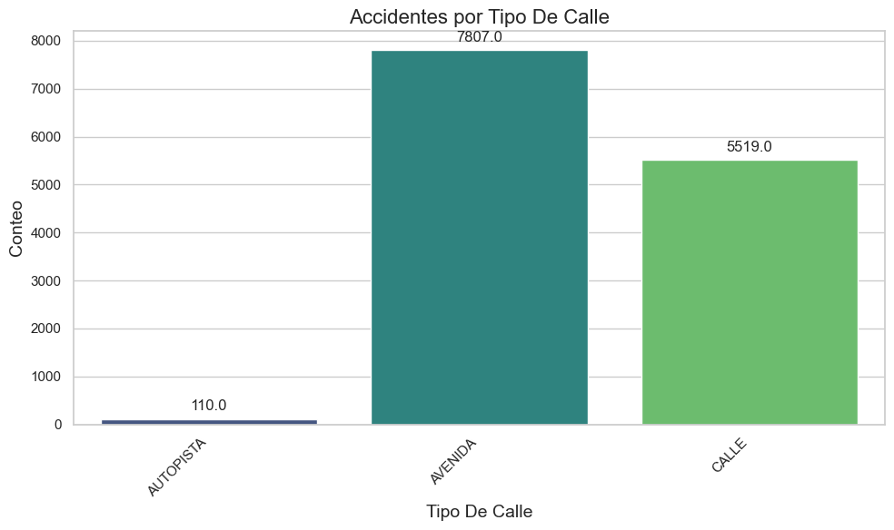
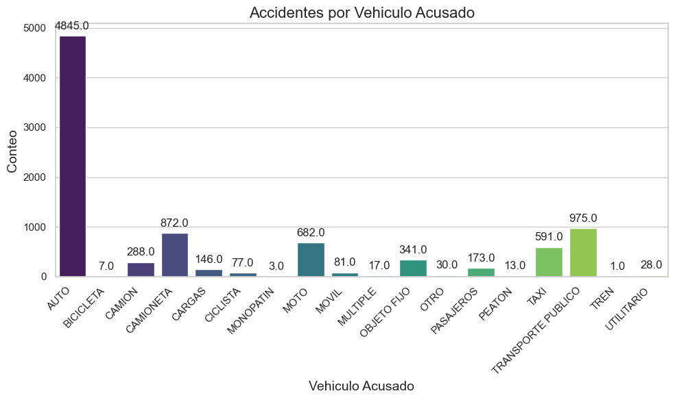
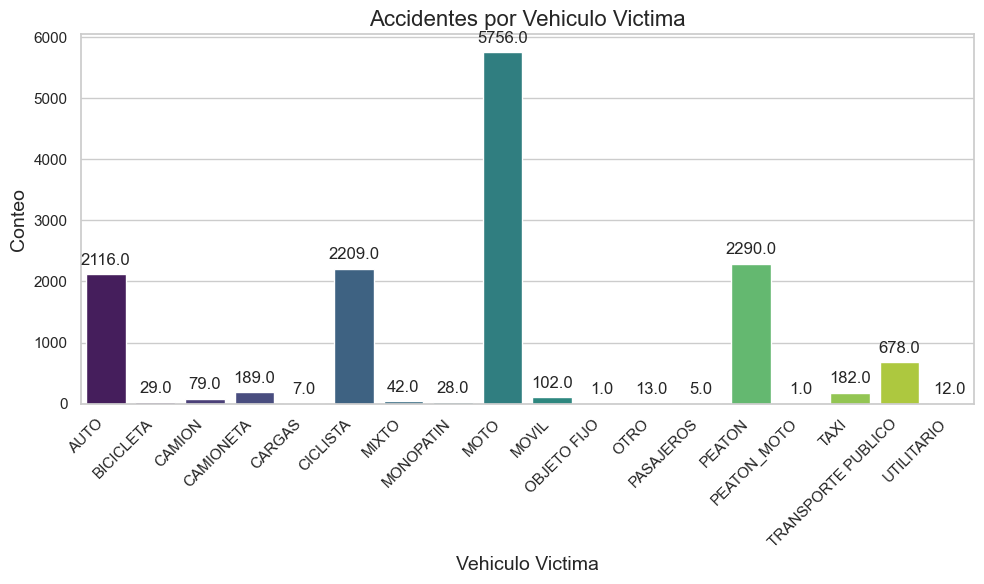
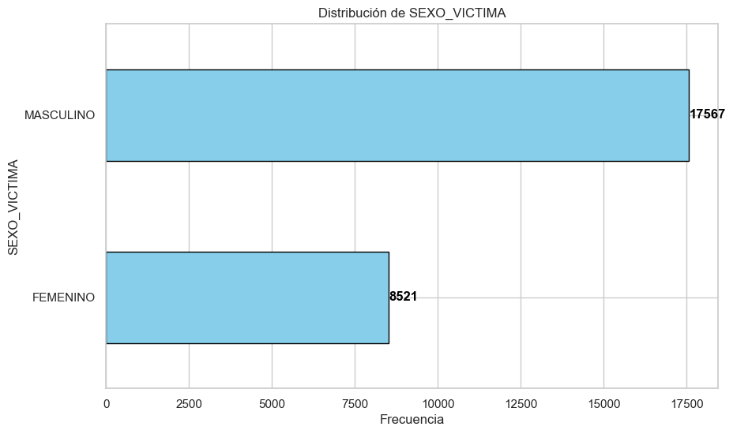

<h2 align='center'>
 Proyecto integrador de Data Analyst
</h2>

 <h3 align='center'>
    Hanson Aaron
</h3>

 <h2 align='center'>
 <b>Siniestros viales en la ciudad de Buenos Aires</b>
</h2>

 

<h1 align="center"> PROYECTO INDIVIDUAL Nº 2 </h1>

# <h1 align="center">**`Análisis de Datos de Siniestros Viales en la Ciudad de Buenos Aires`**</h1>

¡Bienvenido al proyecto de análisis de datos de siniestros viales en la ciudad de Buenos Aires! 
Este proyecto tiene el objetivo de descubrir insights y proponer sugerencias para su mitigación.

## Problemática
La ciudad de Buenos Aires, al igual que muchas capitales a nivel mundial, se encuentra confrontando una importante problemática relacionada con los siniestros viales. Dichos incidentes constituyen una preocupación prioritaria para las autoridades locales, quienes han implementado diversas estrategias con el objetivo de mitigar su incidencia. Entre estas iniciativas, se destaca la recopilación sistemática de datos generados por los siniestros, proporcionando así una oportunidad invaluable para llevar a cabo un análisis exhaustivo y obtener conclusiones significativas.

## Estructura del Repositorio 

-   **[Datasets](Datasets)**: Es la carpeta que contiene los datasets utilizados en el proyecto, tanto los provistos por la cátedra como los generados durante el desarrollo del proyecto. A su vez, en esta carpeta se encuentran el archivo jupyter notebook [KPI](Datasets/5-KPIs.ipynb) los cuales realizan procesamientos extras que sirven para el desarrollo del dashboard en Power BI.

-   **[ETL](1-ETL.ipynb)**: Es el archivo en donde se cargan de datos y realizan algunas transformaciones.

-   **[EDA](2-EDA.ipynb)**: Es el archivo que contiene el análisis exploratorio de datos.

-   **[Dashboard](3-Dashboard.pbix)**: Este documento alberga el panel de control correspondiente a la aplicación Power BI.

## Desarrollo del Proyecto

Durante la ejecución del proyecto, se han generado los siguientes archivos:

1. **Datasets**: Se han creado varios archivos en formato .xlsx para su análisis en el proyecto. Estos archivos contienen información detallada sobre homicidios, lesiones, víctimas de homicidios y víctimas de lesiones. Estos datasets han sido sometidos a un proceso ETL (Extract, Transform, Load) con el propósito de facilitar su análisis en el EDA (Exploratory Data Analysis) y en Power BI.

2. **ETL**: En el archivo en Python designado para este propósito, se han llevado a cabo transformaciones y limpieza de datos con el objetivo de mejorar su manejo durante el análisis. Algunas de las acciones implementadas comprenden:

   - Eliminación de columnas redundantes, como año, mes y día.
   - Limpieza de datos en columnas con valores dispares, tales como "SD", ".", etc.
   - Modificación de tipos de datos para facilitar su manipulación.
   - Renombrado de columnas para asegurar uniformidad entre los archivos.
   - Adición de una columna de gravedad al dataset de homicidios para diferenciarlo del dataset de lesiones.
   - Introducción de una columna de rango etario en lugar de la columna de edad.
   - Sustitución de valores faltantes y atípicos con NaN.
   - Ajuste del formato de fechas para garantizar su correcto procesamiento.

3. **EDA**: Se han generado visualizaciones y tablas para explorar en detalle los datos. Algunas de las acciones llevadas a cabo incluyen:

   - Creación de tablas para analizar información relacionada con el lugar de los siniestros viales, el vehículo involucrado, el número de víctimas, y otros aspectos vinculados con las fechas.
   - Análisis de datos de víctimas para comprender características como edad, sexo, tipo de vehículo de la víctima, entre otros.

   De los gráficos se pueden realizar observaciones como las siguientes:

   
     

   - La comuna 1 es la que tiene mayor cantidad de siniestros viales debido a que está compuesta por barrios como Retiro, San Nicolás y Puerto Madero, los cuales son áreas de alto tránsito vehicular por ser zonas turísticas y de oficinas. 
   
     

   - La mayor cantidad de siniestros viales se da en Avenidas

   

    
    

- En gran medida los accidentes son ocasionados por automovilistas y las víctimas son motociclistas.

     

- En lo que a sexo concierne, los hombres son los que más se ven involucrados en siniestros viales.

     

- Las personas entre 19 y 39 años son las más propensas a protagonizar accidentes de tránsito.

4. **Dashboard en Power BI**:
   El dashboard en Power BI consta de diversas páginas que presentan información relevante sobre los siniestros viales y sus víctimas. Detallaremos cada una de estas páginas:

   - **Página de Accidentes**: Muestra la ocurrencia de siniestros viales, ya sea accidentes fatales, con lesiones graves o lesiones leves. Permite identificar la comuna donde son más frecuentes los siniestros, así como los años de mayor incidencia. Esta información es crucial para que el gobierno de Buenos Aires implemente medidas preventivas y correctivas eficaces.

   - **Página de Víctimas**: Exhibe el perfil de las víctimas de accidentes fatales y lesiones. Se observa que las víctimas son mayormente de sexo masculino, con edades entre 19 y 39 años. Además, se identifica que muchas de las víctimas son conductores de motocicletas y peatones. Conocer el perfil de las víctimas orienta los esfuerzos para reducir la cantidad de víctimas y siniestros.
  
   - **Página de KPI**: Presenta los Indicadores Clave de Rendimiento (KPI) que evalúan las acciones gubernamentales para disminuir siniestros y víctimas. Los KPIs incluyen:

      - *Tasa de Homicidios*: Reducción del 10% en la tasa de homicidios en siniestros viales de los últimos seis meses, en CABA, en comparación con el semestre anterior.

      - *Accidentes Mortales de Motociclistas*: Reducción del 7% en la cantidad de accidentes mortales de motociclistas en el último año, en CABA, respecto al año anterior.

   El dashboard en Power BI ofrece una visión clara y concisa de la problemática de los siniestros viales, permitiendo tomar decisiones basadas en datos para reducir su incidencia y proteger a las víctimas.

## Autor
* **Hanson Aaron Veliendres** 
